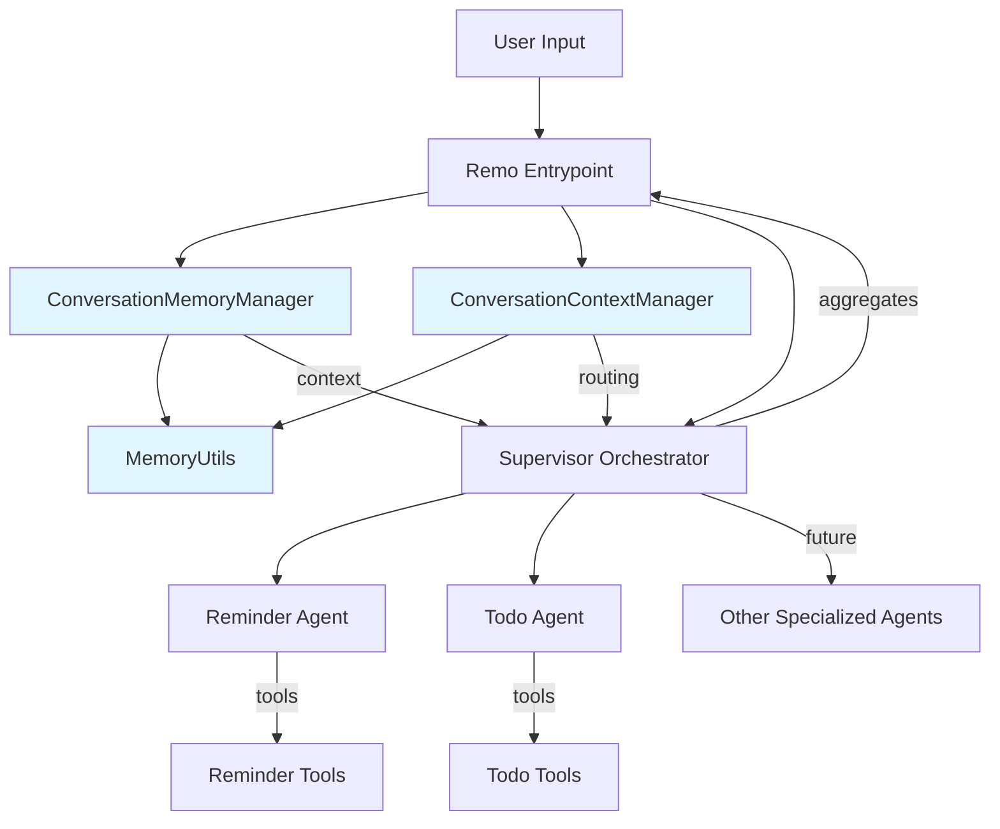

# 🏗️ Remo Architecture Overview

Remo is a multi-agent orchestration system designed for extensibility, clarity, and developer productivity. It leverages modern AI frameworks to coordinate specialized agents for personal assistance tasks.

## System Components

- **Agents**: Specialized, focused on a single domain (e.g., reminders, todos). Each agent has its own tools and persona.
- **Supervisor Orchestrator**: Routes user requests to the right agent(s) and aggregates responses. Implements the supervisor pattern using LangGraph.
- **Memory System**: Manages conversation context, state, and multi-turn interactions across agents.
- **Remo Entrypoint**: The main CLI and user interface, handling input/output and coordinating with the supervisor.
- **Visualization**: Tools to visualize the orchestration graph and agent relationships.
- **State Management**: Shared state for message passing and context across agents.

## Memory System Architecture

The memory system consists of three core components:

### 1. ConversationMemoryManager

- **Purpose**: Manages conversation history using LangChain memory components
- **Memory Types**: Supports buffer (short-term) and summary (long-term) memory
- **Features**: Message persistence, conversation export/import, memory type switching
- **Use Cases**: Daily conversations, extended sessions, context preservation

### 2. ConversationContextManager

- **Purpose**: Manages conversation state, pending requests, and routing logic
- **Features**: Context-aware routing, pending request management, conversation state tracking
- **Use Cases**: Multi-turn conversations, incomplete request handling, intelligent routing

### 3. MemoryUtils

- **Purpose**: Utility functions for intent detection and conversation analysis
- **Features**: Intent detection, time/task extraction, context keyword generation
- **Use Cases**: Automatic routing, context analysis, conversation flow optimization

## Technology Stack

- **LangChain**: For LLM integration and tool execution.
- **LangGraph**: For multi-agent orchestration and graph-based workflows.
- **LangSmith**: For tracing, debugging, and monitoring agent interactions.
- **LangChain Memory**: For conversation memory management and context preservation.

## How It Works

1. **User Input**: User interacts with Remo via CLI or other interface.
2. **Supervisor Orchestrator**: Receives input, determines which agent(s) should handle the request.
3. **Agents**: Each agent processes its part of the request using its tools and persona.
4. **Aggregation**: Supervisor combines responses and returns a coordinated answer to the user.

## System Diagram

## Extensibility

- Add new agents by following the agent template and registering them with the supervisor.
- Extend orchestration logic for more complex workflows.
- Visualize and debug using provided tools.

---

See the other guides for details on building, extending, and debugging the system.
