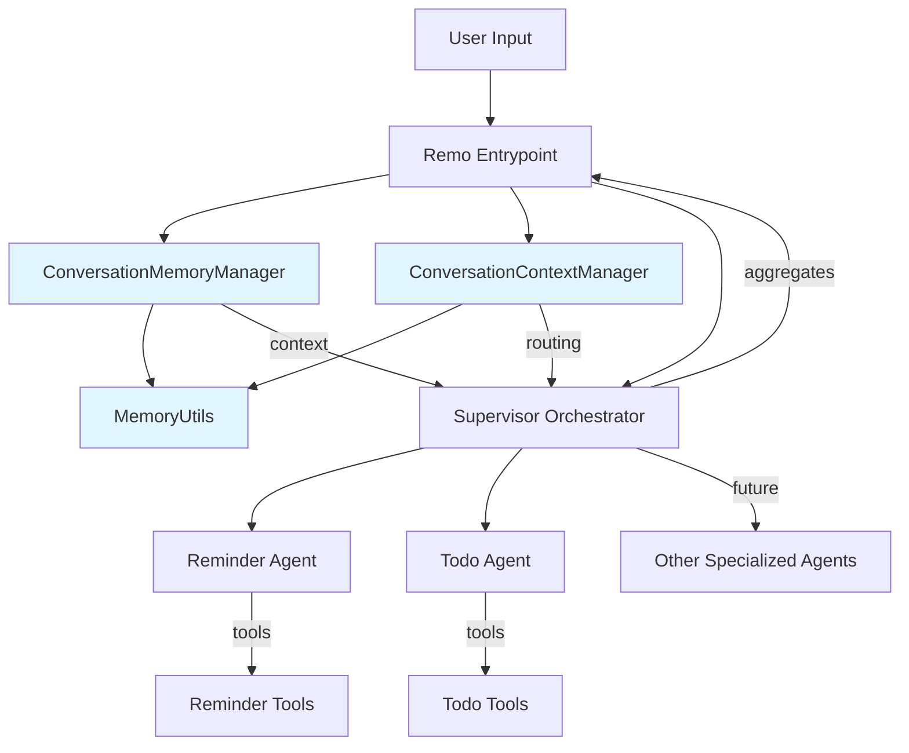

# 🏗️ Remo Architecture Overview

Remo is a multi-agent orchestration system designed for extensibility, clarity, and developer productivity. It leverages modern AI frameworks to coordinate specialized agents for personal assistance tasks.

## System Components

- **Agents**: Specialized, focused on a single domain (e.g., reminders, todos). Each agent has its own tools and persona.
- **Supervisor Orchestrator**: Routes user requests to the right agent(s) and aggregates responses. Implements the supervisor pattern using LangGraph.
- **Memory System**: Manages conversation context, state, and multi-turn interactions across agents.
- **Remo API Entrypoint**: The main API server (`app.py`), handling input/output and coordinating with the supervisor.
- **Visualization**: Tools to visualize the orchestration graph and agent relationships.
- **State Management**: Shared state for message passing and context across agents.

## Memory System Architecture

The memory system consists of three core components:

### 1. ConversationMemoryManager

- **Purpose**: Manages conversation history using LangChain memory components
- **Memory Types**: Supports buffer (short-term) and summary (long-term) memory
- **Features**: Message persistence, conversation export/import, memory type switching
- **Use Cases**: Daily conversations, extended sessions, context preservation

### 2. ConversationContextManager

- **Purpose**: Manages conversation state, pending requests, and routing logic
- **Features**: Context-aware routing, pending request management, conversation state tracking
- **Use Cases**: Multi-turn conversations, incomplete request handling, intelligent routing

### 3. MemoryUtils

- **Purpose**: Utility functions for intent detection and conversation analysis
- **Features**: Intent detection, time/task extraction, context keyword generation
- **Use Cases**: Automatic routing, context analysis, conversation flow optimization

## Technology Stack

- **LangChain**: For LLM integration and tool execution.
- **LangGraph**: For multi-agent orchestration and graph-based workflows.
- **LangSmith**: For tracing, debugging, and monitoring agent interactions.
- **LangChain Memory**: For conversation memory management and context preservation.

## How It Works

1. **User Input**: User interacts with Remo via CLI or other interface.
2. **Supervisor Orchestrator**: Receives input, determines which agent(s) should handle the request.
3. **Agents**: Each agent processes its part of the request using its tools and persona.
4. **Aggregation**: Supervisor combines responses and returns a coordinated answer to the user.

## System Diagram



## Extensibility

- Add new agents by following the agent template and registering them with the supervisor.
- Extend orchestration logic for more complex workflows.
- Visualize and debug using provided tools.

---

See the other guides for details on building, extending, and debugging the system.

## Architecture Overview

This document provides a comprehensive overview of the Remo AI Assistant architecture, including the multi-agent system, conversation memory, and FastAPI integration.

## System Architecture

```
┌─────────────────┐    ┌─────────────────┐    ┌─────────────────┐
│   Frontend      │    │   FastAPI       │    │   Remo Core     │
│   (React)       │◄──►│   Backend       │◄──►│   (LangGraph)   │
└─────────────────┘    └─────────────────┘    └─────────────────┘
                              │
                              ▼
                       ┌─────────────────┐
                       │   Agents        │
                       │   • Reminder    │
                       │   • Todo        │
                       └─────────────────┘
```

## Core Components

### 1. FastAPI Backend (`app.py`)

The FastAPI backend serves as the primary interface between the frontend and the Remo AI system.

**Key Features:**

- RESTful API endpoints
- Automatic OpenAPI documentation
- CORS support for frontend integration
- Request/response validation with Pydantic
- Global error handling
- Health check monitoring

**Main Endpoints:**

- `GET /health` - Service health check
- `POST /chat` - Main chat endpoint with conversation memory

**Architecture Benefits:**

- High performance with async support
- Automatic API documentation
- Type safety with Pydantic models
- Easy deployment and scaling

### 2. Multi-Agent Orchestration

The core of Remo's intelligence is the multi-agent orchestration system built with LangGraph.

**Supervisor Pattern:**

- Centralized coordination of specialized agents
- Intelligent routing based on intent detection
- Seamless integration maintaining Remo's personality
- Fallback handling for graceful degradation

**Agent Specialists:**

- **Reminder Agent**: Manages reminders, alerts, and scheduled tasks
- **Todo Agent**: Handles todo lists, task organization, and project management

### 3. Conversation Memory System

Advanced memory management for context-aware conversations.

**Memory Types:**

- **Buffer Memory**: Short-term, preserves exact conversation history
- **Summary Memory**: Long-term, summarizes conversations for efficiency
- **Auto-switching**: Adapts memory type based on conversation length

**Key Features:**

- Persistent context across multi-turn conversations
- Intent detection for automatic routing
- Pending request management
- Conversation persistence and recovery

### 4. State Management

**Persistent Storage:**

- Reminders stored in `reminders.json`
- Todos stored in `todos.json`
- Conversation history maintained in memory

**State Flow:**

1. User input received via API
2. Message added to conversation memory
3. Intent detection and context analysis
4. Routing to appropriate agent(s)
5. Response generation and memory update
6. Coordinated response returned to user

## Data Flow

### Request Processing Flow

```
1. Frontend Request
   ↓
2. FastAPI Endpoint (/chat)
   ↓
3. Request Validation (Pydantic)
   ↓
4. Conversation Memory Update
   ↓
5. Intent Detection & Context Analysis
   ↓
6. Agent Routing (Supervisor)
   ↓
7. Specialized Agent Processing
   ↓
8. Response Aggregation
   ↓
9. Memory Update
   ↓
10. Response Validation
    ↓
11. Frontend Response
```

### Memory Management Flow

```
1. New Message Received
   ↓
2. Add to Conversation Memory
   ↓
3. Check for Pending Requests
   ↓
4. Analyze Intent & Context
   ↓
5. Route to Appropriate Agent
   ↓
6. Process with Agent Context
   ↓
7. Update Memory with Response
   ↓
8. Return Coordinated Response
```

## Technology Stack

### Backend Technologies

**FastAPI Framework:**

- High-performance async web framework
- Automatic API documentation
- Type safety with Pydantic
- Built-in CORS support

**LangChain & LangGraph:**

- Multi-agent orchestration
- LLM integration and management
- Stateful conversation handling
- Tool calling and function execution

**OpenAI Integration:**

- GPT-4o-mini for natural language processing
- Function calling for agent tools
- Context-aware responses

### Frontend Technologies

**React + TypeScript:**

- Modern UI framework
- Type safety and development experience
- Component-based architecture

**Vite:**

- Fast development server
- Optimized production builds
- Hot module replacement

**Tailwind CSS:**

- Utility-first styling
- Responsive design
- Consistent design system

## Deployment Architecture

### Backend Deployment (Render)

```
┌─────────────────┐    ┌─────────────────┐    ┌─────────────────┐
│   Load Balancer │    │   FastAPI App   │    │   File Storage  │
│   (Render)      │◄──►│   (Python)      │◄──►│   (JSON Files)  │
└─────────────────┘    └─────────────────┘    └─────────────────┘
                              │
                              ▼
                       ┌─────────────────┐
                       │   Environment   │
                       │   Variables     │
                       └─────────────────┘
```

### Frontend Deployment (Vercel)

```
┌─────────────────┐    ┌─────────────────┐    ┌─────────────────┐
│   CDN           │    │   Static Build  │    │   API Backend   │
│   (Vercel)      │◄──►│   (React App)   │◄──►│   (Render)      │
└─────────────────┘    └─────────────────┘    └─────────────────┘
```

## Security Considerations

### API Security

**Input Validation:**

- Pydantic models for request validation
- Content filtering for potential injection attacks
- Rate limiting to prevent abuse

**CORS Configuration:**

- Configured for frontend domains
- Secure credential handling
- Environment-based configuration

**Error Handling:**

- Graceful error responses
- No sensitive information exposure
- Comprehensive logging

### Data Security

**Storage:**

- Local JSON files for development
- Secure environment variables
- No sensitive data in code

**Communication:**

- HTTPS for all production traffic
- Secure API key management
- Request/response encryption

## Performance Optimization

### Backend Performance

**Async Processing:**

- FastAPI async endpoints
- Non-blocking I/O operations
- Efficient memory management

**Caching Strategy:**

- Conversation memory optimization
- Agent response caching
- Request deduplication

**Resource Management:**

- Connection pooling
- Memory usage monitoring
- Automatic cleanup

### Frontend Performance

**Code Splitting:**

- Lazy loading of components
- Route-based code splitting
- Optimized bundle sizes

**Caching:**

- Browser caching strategies
- API response caching
- Static asset optimization

## Monitoring and Observability

### Health Monitoring

**API Health Checks:**

- `/health` endpoint for service status
- Detailed metrics endpoint
- System resource monitoring

**Performance Metrics:**

- Request/response times
- Error rates and types
- Memory and CPU usage

### Logging and Debugging

**Structured Logging:**

- Request/response logging
- Error tracking and reporting
- Performance monitoring

**Debugging Tools:**

- LangSmith integration for LLM tracing
- API documentation for testing
- Development mode features

## Scalability Considerations

### Horizontal Scaling

**Stateless Design:**

- FastAPI stateless endpoints
- External state management
- Load balancer support

**Database Considerations:**

- Future migration to persistent database
- Connection pooling
- Query optimization

### Vertical Scaling

**Resource Optimization:**

- Memory-efficient processing
- CPU optimization
- I/O optimization

**Caching Strategy:**

- Redis integration potential
- Response caching
- Session management

## Future Enhancements

### Planned Features

**Advanced Agents:**

- Email management agent
- Calendar integration agent
- Research and analysis agent

**Enhanced Memory:**

- Long-term memory persistence
- User preference learning
- Context-aware recommendations

**API Enhancements:**

- WebSocket support for real-time chat
- Streaming responses
- Batch processing capabilities

### Integration Opportunities

**Third-party Services:**

- Calendar APIs (Google, Outlook)
- Email services
- Project management tools

**Advanced Features:**

- Voice interface
- Mobile app development
- Enterprise integrations

## Development Workflow

### Local Development

```bash
# Backend
cd REMO-SERVER
source venv/bin/activate
python app.py

# Frontend
cd REMO-APP
npm run dev:web
```

### Testing Strategy

**Unit Tests:**

- API endpoint testing
- Agent functionality testing
- Memory system testing

**Integration Tests:**

- End-to-end API testing
- Frontend-backend integration
- Multi-agent coordination

**Performance Tests:**

- Load testing
- Memory usage testing
- Response time testing

## Conclusion

The Remo AI Assistant architecture provides a robust, scalable, and maintainable foundation for a sophisticated AI assistant. The combination of FastAPI, LangGraph, and React creates a modern, high-performance system that can evolve and scale with user needs.

Key strengths of this architecture include:

- **Modularity**: Clear separation of concerns
- **Scalability**: Designed for growth and expansion
- **Maintainability**: Well-structured and documented
- **Performance**: Optimized for speed and efficiency
- **Security**: Built with security best practices
- **Observability**: Comprehensive monitoring and debugging

This architecture serves as a solid foundation for building advanced AI assistant capabilities while maintaining simplicity and ease of use.

---

**For detailed implementation guides, see the other documentation files in this directory.**
