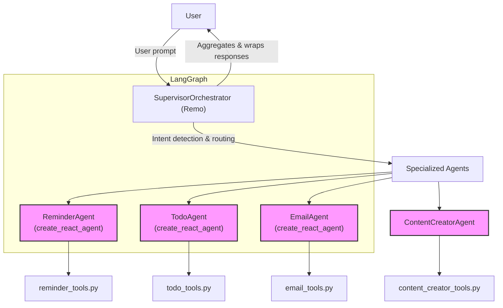

# Remo Multi-Agent Orchestration System

## What is Remo?

Remo is a smart assistant that can help you with reminders, todos, emails, and creating images. It works like a team: there's a supervisor (Remo) who listens to you and then asks the right specialist (agent) to help. Each agent has special tools to do their job.

---

## How Does Remo Work? (Step by Step)

1. **You (the User) send a message** (like "Remind me to call mom at 5pm").
2. **Remo (the Supervisor)** gets your message and figures out what you want.
3. **Remo picks the right agent** (like the Reminder Agent for reminders).
4. **The agent uses its tools** (like a function to save a reminder) to do the job.
5. **The agent sends the answer back to Remo.**
6. **Remo wraps the answer in a friendly message** and sends it back to you.

---

## Main Technologies Used

### 1. **LangChain**

- A toolkit for building AI assistants that can use tools and remember things.
- Used for: Tool wrapping, memory, and agent logic (see `src/agents/` and `src/memory/`).

### 2. **LangGraph**

- Lets you build workflows where different agents and tools can talk to each other in a graph (like a flowchart).
- Used for: Creating the supervisor and agent logic (see `src/orchestration/` and agent files).

### 3. **LangSmith**

- (Not directly used, but supported by LangGraph/LangChain for tracing and analytics.)
- You can add it for debugging and tracking conversations.

### 4. **AWS Bedrock**

- Amazon's service for running powerful AI models (like chatbots and image generators).
- Used for: Running the main AI models that power Remo and the agents (see `src/agents/content_creator/content_creator_tools.py` and agent files).

### 5. **DynamoDB**

- Amazon's NoSQL database for saving data.
- Used for: Storing reminders, todos, emails, and conversation history (see `src/utils/dynamodb_service.py`).

### 6. **Google Client**

- Used for: Integrating with Google services (like Google Calendar for scheduling meetings). (See `src/agents/email/email_tools.py` and `src/utils/google_calendar_service.py`)

---

## Architecture Diagram

---

## Who Does What? (Agents and Their Tools)

### 1. **SupervisorOrchestrator (Remo)**

- Listens to the user.
- Decides which agent should help.
- Makes sure the answer is friendly and clear.
- Uses LangGraph to manage the flow.
- File: `src/orchestration/supervisor.py`

### 2. **ReminderAgent**

- Handles reminders (set, list, update, delete, mark complete).
- Tools: `set_reminder`, `list_reminders`, `update_reminder`, `delete_reminder`, `mark_reminder_complete` (in `reminder_tools.py`).
- Uses LangGraph's `create_react_agent` for smart reasoning.
- File: `src/agents/reminders/reminder_agent.py`

### 3. **TodoAgent**

- Handles todos (add, list, update, delete, mark complete, prioritize).
- Tools: `add_todo`, `list_todos`, `update_todo`, `delete_todo`, `mark_todo_complete`, `prioritize_todos` (in `todo_tools.py`).
- Uses LangGraph's `create_react_agent`.
- File: `src/agents/todo/todo_agent.py`

### 4. **EmailAgent**

- Handles emails (compose, send, schedule, search, mark read, archive, forward, reply, summarize).
- Tools: `compose_email`, `send_email`, `schedule_email`, `search_emails`, `mark_email_read`, `archive_email`, `forward_email`, `reply_to_email`, `get_email_summary` (in `email_tools.py`).
- Can also schedule meetings using Google Calendar.
- Uses LangGraph's `create_react_agent`.
- File: `src/agents/email/email_agent.py`

### 5. **ContentCreatorAgent**

- Handles image generation (and in the future, video).
- Tool: `generate_nova_canvas_image` (in `content_creator_tools.py`).
- File: `src/agents/content_creator/content_creator_agent.py`

---

## DynamoDB Tables (and What's Inside)

- **remo-reminders**: Stores reminders for each user.
- **remo-todos**: Stores todos for each user.
- **remo-conversations**: Stores conversation history (each message with user_id, timestamp, role, content).
- **remo-conversation-context**: Stores conversation context (agent state, history, keywords, etc.).
- **remo-users**: Stores user details.

Each table is managed in `src/utils/dynamodb_service.py`.

---

## How AWS Bedrock is Used

- The main AI models (for chat, reasoning, and image generation) are run on AWS Bedrock.
- Each agent (and the supervisor) can use Bedrock models for smart responses.
- ContentCreatorAgent uses Bedrock to generate images.
- See: `src/agents/content_creator/content_creator_tools.py` and agent files.

---

## How Google Client is Used

- For scheduling meetings and calendar events (mainly in EmailAgent).
- Uses Google Calendar API via helper functions.
- See: `src/utils/google_calendar_service.py` and `src/agents/email/email_tools.py`.

---

## Message Flow (Like a Story)

1. **You say:** "Remind me to call mom at 5pm."
2. **Remo (Supervisor) thinks:** "This is a reminder! I'll ask the ReminderAgent."
3. **ReminderAgent says:** "Okay, I'll set a reminder for 5pm to call mom."
4. **ReminderAgent uses its tool:** Calls `set_reminder` to save the reminder in DynamoDB.
5. **Remo gets the answer:** "I've set a reminder to call mom at 5pm for you!"
6. **You see the answer.**

---

## All the Possibilities (What You Can Ask)

- **Reminders:** Set, list, update, delete, mark as complete.
- **Todos:** Add, list, update, delete, mark as complete, prioritize.
- **Emails:** Compose, send, schedule, search, mark as read, archive, forward, reply, summarize, schedule meetings.
- **Images:** Generate images from text prompts.

---

## How to Add More

- **New Agent:** Create a new agent class, add tools, register in SupervisorOrchestrator, add routing.
- **New Tool:** Add a Python function, wrap it for the agent, and document what it does.

---

## Where to Find Everything

- **Supervisor:** `src/orchestration/supervisor.py`
- **Agents:** `src/agents/`
- **Agent Tools:** `src/agents/*_tools.py`
- **DynamoDB Service:** `src/utils/dynamodb_service.py`
- **Google Calendar:** `src/utils/google_calendar_service.py`
- **Content Creation:** `src/agents/content_creator/content_creator_tools.py`

---

## For Developers (and Curious Users)

- The system is modular and easy to extend.
- All user requests go through the Supervisor, which delegates to agents.
- Agents use LangGraph and LangChain for smart reasoning and tool use.
- Data is stored in DynamoDB tables, organized by user and type.
- AWS Bedrock powers the AI models.
- Google client is used for calendar integration.

---

If you have any questions, just ask Remo or check the code in the folders above. This README is your map to the Remo universe!
